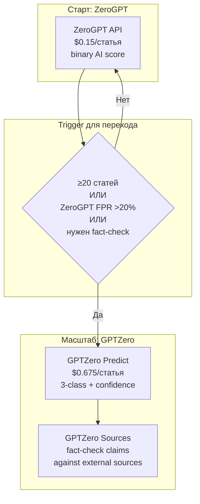

# Решение: GPTZero в broker content pipeline

> Версия: 1.0 | Дата: 2026-04-02
> Статус: РЕШЕНИЕ (требует согласования)
> Задача: EGOR-GPTZERO-RESEARCH-010
> Автор: Claude (executor session)

---

## Вопрос

Подходит ли GPTZero для нашего text-checking skill? Должен ли GPTZero заменить ZeroGPT, дополнить его, или остаться вне скоупа?

---

## Вердикт: GPTZero ПОДХОДИТ, но как UPGRADE, не как стартовый инструмент

### Рекомендация по фазам

| Фаза | Инструмент | Причина |
|------|-----------|---------|
| **Старт (0-20 статей)** | **ZeroGPT** | Дешевле (pay-as-you-go, $0.15/статья), достаточно для калибровки |
| **Масштаб (20+ статей)** | **GPTZero** | Лучше accuracy, 3-class confidence, Relevant Sources API |
| **Post-publish** | **Ahrefs** | Site Audit, AI Content Level, Brand Radar — Ahrefs незаменим |

### Почему НЕ сразу GPTZero

1. **Минимальный план $45/мес.** Для первых 5-10 статей — переплата. ZeroGPT = pay-as-you-go, платим только за использование.
2. **Калибровка.** Первые 10-20 статей нужны для настройки порогов. Тратить $45+/мес на калибровочные тексты нерационально.
3. **Нет гарантии** что AI detection вообще будет полезен в workflow. Нужно сначала проверить concept на дешёвом инструменте.

### Почему GPTZero лучше ZeroGPT на масштабе

1. **3-class confidence.** `HUMAN_ONLY / MIXED / AI_ONLY` + `high/medium/low` confidence > простой процент. Можно фильтровать по high-confidence, снижая false positives.
2. **Relevant Sources API.** Уникальная возможность: проверка factual claims в broker reviews. "IG's EUR/USD spread is 0.6 pips" → источник найден/не найден. Ни ZeroGPT, ни Ahrefs это не делают.
3. **Лучшая академическая валидация.** Chicago Booth 2026: 99.3% recall at 0.1% FPR — единственный AI-детектор с credible independent benchmark.
4. **SOC 2.** Для enterprise клиентов может быть requirement.
5. **Задокументированные rate limits.** 30K req/hr — задокументированная квота. ZeroGPT: rate limits не задокументированы. (Примечание: rate limit ≠ SLA; SLA = гарантия uptime/поддержки, отдельно не заявлен ни одним из сервисов.)

### Почему НЕ замена Ahrefs

GPTZero и Ahrefs решают разные задачи (без изменений от task 009):
- GPTZero = pre-publish AI detection + fact-checking claims
- Ahrefs = SEO (keywords, backlinks, SERP) + post-publish AI content level monitoring

---

## Обновлённый pipeline (с учётом GPTZero как upgrade path)

### Стартовая архитектура (без изменений от task 009)

```
Layer 1: /broker-writer   → генерация draft
Layer 2: /broker-checker  → quality gate (structure, facts, SEO, compliance, humanization)
Layer 3: ZeroGPT API      → автоматическая AI detection ($0.15/статья)
Layer 4: Human + Ahrefs   → ручная верификация + post-publish monitoring
```

### Архитектура при масштабировании (GPTZero upgrade)

```
Layer 1: /broker-writer   → генерация draft
Layer 2: /broker-checker  → quality gate
Layer 3a: GPTZero API     → AI detection с 3-class confidence ($0.675/статья)
Layer 3b: GPTZero Sources → fact-check claims в тексте (Relevant Sources API)
Layer 4: Human + Ahrefs   → ручная верификация + post-publish
```

**Новое в Layer 3b:** GPTZero Relevant Sources API проверяет factual claims в broker review. Это дополняет `/broker-checker` (который сверяет с input.json) — Relevant Sources проверяет claims **против внешних источников**.

### Mermaid: upgrade path



---

## Стоимость: сценарии

| Масштаб | ZeroGPT | GPTZero (300K) | GPTZero (1M) | Дельта |
|---------|---------|----------------|-------------|--------|
| 10 статей/мес | $1.50 | $45 (min plan) | — | +$43.50 |
| 50 статей/мес | $7.50 | ~$55-60 | — | +$50 |
| 100 статей/мес | $15 | — | $135 | +$120 |
| 200 статей/мес | $30 | — | $135 | +$105 |

**Breakeven по цене:** GPTZero **не становится дешевле ZeroGPT** ни при каком масштабе. 1M слов / 4500 слов ≈ 222 статьи → $135 / 222 ≈ **$0.61/статья** (vs ZeroGPT $0.15). Переход на GPTZero мотивирован **качеством** (accuracy, 3-class, Sources API), не ценой.

---

## Relevant Sources API — потенциальная интеграция

### Что это даёт для broker reviews

Broker review содержит десятки factual claims:
- "IG is regulated by FCA, ASIC, MAS" → Sources API находит подтверждение
- "EUR/USD spread from 0.6 pips" → Sources API ищет источник
- "IG was founded in 1974" → Sources API проверяет

Это **дополняет** (не заменяет) `/broker-checker`:
- `/broker-checker` сверяет draft vs `input.json` (внутренний fact-check)
- GPTZero Sources сверяет draft vs **внешние источники** (external fact-check)

### Когда интегрировать

Не сейчас. Relevant Sources API — upgrade для масштаба. На старте:
1. `/broker-checker` достаточен для fact-checking (сверка с input.json)
2. Human QA ловит остальное
3. Relevant Sources API = Layer 3b при масштабировании

---

## Итоговая рекомендация

| Вопрос | Ответ |
|--------|-------|
| Подходит ли GPTZero? | **Да**, но как upgrade, не стартовый инструмент |
| Заменить ZeroGPT? | **Нет на старте**, да при масштабе (≥20 статей или ZeroGPT FPR >20%) |
| Дополнить ZeroGPT? | **Нет** — использовать **один из двух**, не оба одновременно |
| Дополнить Ahrefs? | **Да** — разные задачи (AI detection vs SEO/post-publish) |
| Когда переходить на GPTZero? | ≥20 статей/мес, или ZeroGPT FPR >20%, или нужен fact-check через Sources API |
| Budget impact? | +$43-120/мес в зависимости от масштаба |

---

## Открытые вопросы

1. **Relevant Sources API pricing.** Входит в API-план или отдельная стоимость? [UNVERIFIED]
2. **Python SDK актуальность.** PyPI `gptzero` v0.1.2 (Apr 2023) — может быть устаревшим. Нужно проверить при интеграции.
3. **Finance-specific accuracy.** Ни один AI-детектор не тестировался специфически на финансовом контенте. Нужна собственная калибровка.
