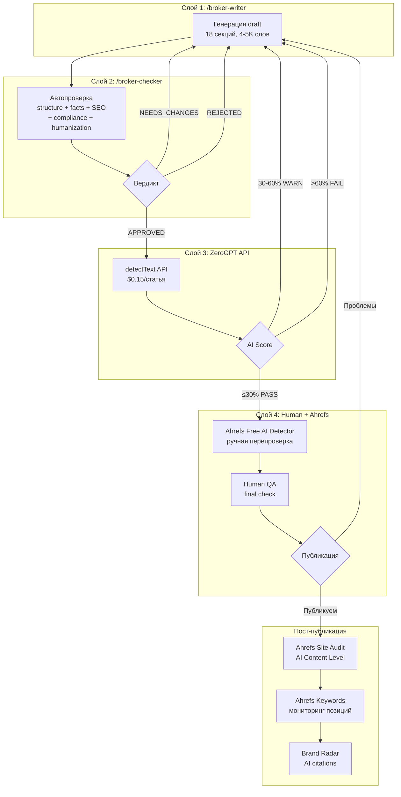

# Решение: ZeroGPT в broker content pipeline

> Версия: 1.1 | Дата: 2026-04-03
> Статус: ОТКЛОНЁН (GPTZero выбран вместо ZeroGPT, см. gptzero-decision.md)
> Задача: EGOR-ZEROGPT-RESEARCH-009
> Автор: Claude (executor session)

---

## Вопрос

Должен ли ZeroGPT заменить Ahrefs в pre-publish проверке, дополнить его, или быть опциональным?

---

## Рекомендация: ZeroGPT ДОПОЛНЯЕТ Ahrefs, не заменяет

### Обоснование

| Критерий | ZeroGPT | Ahrefs |
|----------|---------|--------|
| **Pre-publish AI check** | ✅ API, автоматизируемо | ❌ Только web UI, ручная вставка |
| **Post-publish AI check** | ❌ Нужен текст, не URL | ✅ Page Inspect, Site Audit, Top Pages |
| **Keyword research** | ❌ Не умеет | ✅ Keywords Explorer API |
| **SERP analysis** | ❌ Не умеет | ✅ SERP Overview API |
| **Backlink monitoring** | ❌ Не умеет | ✅ Site Explorer API |
| **AI citations tracking** | ❌ Не умеет | ✅ Brand Radar API |
| **SEO optimization** | ❌ Не умеет | ✅ AI Content Helper (web) |
| **Стоимость** | $0.15/статья | Подписка от Lite ($99/мес) |
| **Автоматизация** | ✅ REST API | Частично (API для SEO, не для AI detection) |

**ZeroGPT и Ahrefs решают разные задачи:**
- ZeroGPT → **pre-publish AI detection** (программный, дешёвый, автоматизируемый)
- Ahrefs → **SEO + post-publish monitoring** (keyword research, backlinks, site audit, AI content level tracking)

Заменять одно другим бессмысленно — они не конкуренты.

---

## Место ZeroGPT в pipeline

### Было (task 008): 3 слоя

```
Layer 1: /broker-writer   → генерация draft
Layer 2: /broker-checker  → автопроверка (structure, facts, SEO, compliance, humanization)
Layer 3: Human + Ahrefs   → РУЧНАЯ AI detection + publish decision
```

### Стало (с ZeroGPT): 4 слоя

```
Layer 1: /broker-writer   → генерация draft
Layer 2: /broker-checker  → автопроверка (structure, facts, SEO, compliance, humanization)
Layer 3: ZeroGPT API      → АВТОМАТИЧЕСКАЯ AI detection (pre-publish)
Layer 4: Human + Ahrefs   → ручная верификация + publish decision + post-publish monitoring
```

### Mermaid: обновлённый поток



---

## Что меняется в существующих спецификациях

### `/broker-checker` (ahrefs-checker-spec.md)

**Без изменений.** Checker продолжает проверять structure/facts/SEO/compliance/humanization. AI detection — НЕ его ответственность.

### `/broker-writer` (broker-writer-spec-v2.md)

**Без изменений.** Writer продолжает генерировать draft. При WARN/FAIL от ZeroGPT → writer получает список flagged sentences и делает targeted humanization pass.

### Интеграция (broker-writer-ahrefs-integration.md)

**Дополнение:** Layer 3 (ZeroGPT) добавляется между Layer 2 (checker) и Layer 4 (human + Ahrefs). Ahrefs остаётся в Layer 4 для ручной верификации и post-publish monitoring.

### State machine

Новое состояние `ai_check` между `approved` и `human_review` (или прямое `approved` → `published` если human_review не нужен):

```
... → in_review → approved → ai_check → human_qa → published → ...
```

| State | Meaning | Who transitions |
|-------|---------|----------------|
| `ai_check` | ZeroGPT API проверяет текст | Автоматически (скилл/скрипт) |
| `ai_check_passed` | ZeroGPT PASS (≤30%) | Автоматически |
| `ai_check_warn` | ZeroGPT WARN (30-60%) | → назад в writer для humanization |
| `ai_check_fail` | ZeroGPT FAIL (>60%) | → назад в writer для серьёзной переработки |

---

## Когда НЕ стоит использовать ZeroGPT

1. **Как единственный критерий качества.** False positive rate 15-25% → нельзя reject хороший текст только по ZeroGPT score.
2. **Как замену factual/structural review.** ZeroGPT не знает, правилен ли спред EUR/USD 0.6 pips.
3. **Для финального publish/reject решения.** Это решение человека, не детектора.
4. **На текстах <150 слов.** Accuracy падает на коротких текстах.

---

## Альтернативы ZeroGPT (если нужна более надёжная автоматизация)

Если ZeroGPT окажется недостаточно точным после калибровки:

| Инструмент | Преимущество | Цена |
|-----------|-------------|------|
| **Originality.ai** | Лучшая документация API, 500 req/min, fact checker, batch endpoint | ~$0.01/100 слов ($14.95/мес Pro) |
| **GPTZero** | 17 SDKs, Zapier, SOC 2, hallucination detector | $12.99/мес Premium (web) / **$45/мес min API** |
| **Copyleaks** | Third-party validated accuracy | Sales-based |

**Рекомендация:** начать с ZeroGPT (дешевле, API есть). Если false positive rate >20% на наших текстах → перейти на Originality.ai.

---

## Стоимость

| Масштаб | ZeroGPT Basic | С re-checks (2x) | Originality.ai Pro |
|---------|--------------|-------------------|-------------------|
| 10 статей/мес | ~$1.50 | ~$3 | ~$4.50 |
| 50 статей/мес | ~$7.50 | ~$15 | ~$22.50 |
| 100 статей/мес | ~$15 | ~$30 | ~$45 |

ZeroGPT — самый дешёвый вариант для масштабов Егора.

---

## Реализация: минимальный путь

### Вариант A: inline в broker-checker (НЕ рекомендуется)

Встроить ZeroGPT вызов в `/broker-checker`. Проблема: нарушает separation of concerns. Checker проверяет качество текста по criteria, ZeroGPT проверяет AI-likelihood — это разные задачи с разными failure modes.

### Вариант B: отдельный скрипт/скилл (рекомендуется)

Отдельный скрипт `zerogpt_check.py` или skill `/zerogpt-check`:
1. Читает `content/{slug}/approved.md`
2. Вызывает ZeroGPT API `/api/detect/detectText`
3. Записывает результат в `quality/zerogpt-checks/{slug}.json`
4. Обновляет manifest.json state
5. Если PASS → готов к Human QA
6. Если WARN/FAIL → уведомляет о необходимости humanization

### Формат zerogpt-checks/{slug}.json

```json
{
  "broker_slug": "ig",
  "checked_at": "2026-04-02T15:00:00Z",
  "source_file": "content/ig/approved.md",
  "zerogpt_version": "api-basic",
  "overall_ai_score": 35,
  "overall_human_score": 65,
  "total_words": 4500,
  "ai_words": 1575,
  "flagged_sentences": [
    "Furthermore, IG offers a comprehensive range of trading instruments.",
    "The platform provides robust analytical tools for traders."
  ],
  "verdict": "WARN",
  "action": "humanize flagged sentences",
  "cost_usd": 0.15
}
```

---

## Открытые вопросы

1. **ZeroGPT API key.** Нужна регистрация и оплата Business API. Кто оплачивает — Егор или Tim?
2. **Калибровка порогов.** 30%/60% — стартовые. Нужны 10-20 реальных статей для калибровки.
3. **Какой tier?** Basic ($0.034/1K слов) достаточен для 50K символов/проверку. Для длинных статей Basic хватает.
4. **Fallback на Originality.ai?** Если ZeroGPT false positive >20% → автоматический переход или ручное решение?
