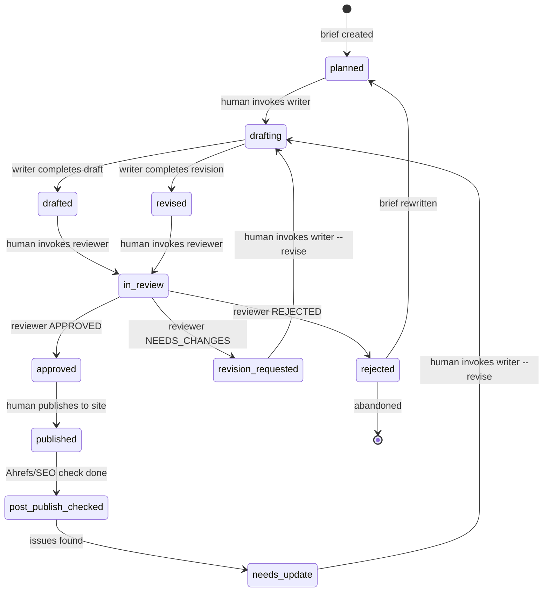
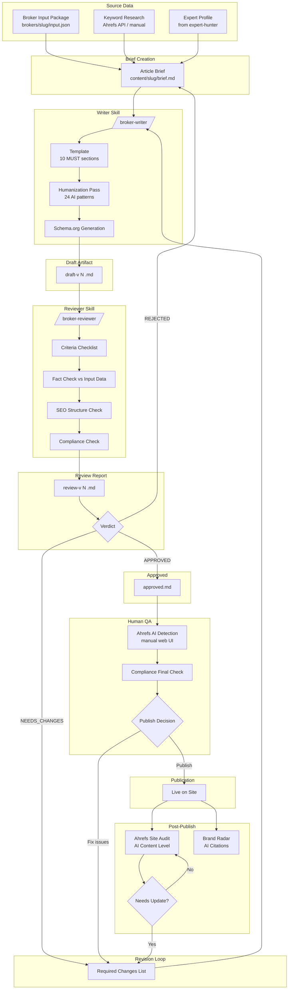

# Content Pipeline System — Specification Draft v0.1

> Status: DRAFT. Not final. Requires Codex adversarial review before acceptance.
> Author: Claude (executor session)
> Date: 2026-04-01

---

## A. Repo Proposal

### Name: `content-pipeline`

### Purpose
Source of truth for the content generation and review system. Contains:
- Specifications and contracts for writer/reviewer skills
- Content artifacts (briefs, drafts, reviews, approved articles)
- Templates (broker review template, schema.org templates)
- State tracking (manifest files for content lifecycle)
- Configuration (Ahrefs integration config, quality criteria)

### Why separate from egor-project

1. **Separation of concerns.** `egor-project` is research and exploration (expert-hunter, competitor analysis, architecture research). `content-pipeline` is operational — it holds the content production system and its artifacts.
2. **Different lifecycle.** Research HTML pages and expert-hunter code change infrequently. Content artifacts (drafts, reviews) change daily at scale.
3. **Git history.** Mixing 100+ draft iterations with expert-hunter code changes makes git log unusable. Content artifacts need their own commit history.
4. **Access model.** If Egor or experts eventually need access to review content, they shouldn't see research internals.
5. **Precedent.** `egor-project/research.html` already proposed `TimmyZinin/rated-brokers` as a separate repo with this exact purpose. This spec refines that proposal.

### What IS in this repo
- Skill specification files (.md)
- Content templates
- Broker input packages (structured data about each broker)
- Content artifacts: briefs, drafts, review reports, approved articles
- Manifest/state files tracking content lifecycle
- Quality criteria configuration
- Ahrefs workflow documentation

### What is NOT in this repo
- Expert-hunter code (stays in `egor-project/expert-hunter/`)
- Research HTML pages (stay in `egor-project/`)
- Skill implementation code (installed to `~/.claude/skills/`)
- API keys, secrets (stay in .env files, never committed)
- Published site code (separate concern — CMS/static site repo)

### Proposed directory structure

```
content-pipeline/
├── README.md                    # Overview, quick start
├── specs/
│   ├── writer-contract.md       # Writer skill input/output contract
│   ├── reviewer-contract.md     # Reviewer skill input/output contract
│   ├── state-machine.md         # Content lifecycle states and transitions
│   └── ahrefs-integration.md    # Ahrefs usage model
├── templates/
│   ├── broker-review.md         # 10-section broker review template
│   ├── comparison.md            # Broker comparison template
│   ├── schema-review.json       # Schema.org Review template
│   ├── schema-article.json      # Schema.org Article template
│   └── schema-faq.json          # Schema.org FAQPage template
├── brokers/
│   └── {broker-slug}/
│       └── input.json           # Broker data package (fees, regulation, platforms)
├── content/
│   ├── manifest.json            # Master manifest: all content items + states
│   └── {broker-slug}/
│       ├── brief.md             # Article brief (keywords, angle, expert)
│       ├── draft-v{N}.md        # Draft versions
│       ├── review-v{N}.md       # Review reports per draft version
│       └── approved.md          # Final approved version (symlink or copy)
├── quality/
│   ├── criteria.json            # Review criteria checklist
│   ├── humanization-patterns.md # 24 AI pattern rules (from Wikipedia guidelines)
│   └── ahrefs-checks/
│       └── {broker-slug}.json   # Ahrefs AI detection results (manual entry)
├── skills/
│   ├── broker-writer.md         # Skill file (installed to ~/.claude/skills/)
│   └── broker-reviewer.md       # Skill file (installed to ~/.claude/skills/)
└── .wiki/                       # GitHub Wiki (cloned)
    ├── Home.md
    ├── Architecture.md
    ├── Content-Lifecycle.md
    ├── Writer-Contract.md
    ├── Reviewer-Contract.md
    ├── Ahrefs-Workflow.md
    └── Changelog.md
```

---

## B. Source of Truth Model

### Canonical entities

| Entity | Format | Location | Versioned? | Who creates | Who modifies |
|--------|--------|----------|-----------|-------------|-------------|
| Broker Input Package | JSON | `brokers/{slug}/input.json` | git | Writer skill or human | Human (data updates) |
| Article Brief | Markdown | `content/{slug}/brief.md` | git | Human or Writer skill | Human |
| Draft | Markdown | `content/{slug}/draft-v{N}.md` | git, numbered versions | Writer skill | Writer skill (new version on revision) |
| Review Report | Markdown | `content/{slug}/review-v{N}.md` | git, numbered versions | Reviewer skill | Reviewer skill only |
| Revision Task | Embedded in Review Report | Section "Required Changes" in `review-v{N}.md` | git | Reviewer skill | N/A (read-only after creation) |
| Approved Artifact | Markdown | `content/{slug}/approved.md` | git | Reviewer skill (copies draft on approval) | Human (post-approval edits) |
| Ahrefs Check | JSON | `quality/ahrefs-checks/{slug}.json` | git | Human (manual entry from web UI) | Human |
| Master Manifest | JSON | `content/manifest.json` | git | System (writer/reviewer update after each action) | Writer or Reviewer skill |

### Versioning rules
- Drafts: `draft-v1.md`, `draft-v2.md`, etc. Writer creates new version, never overwrites.
- Reviews: `review-v1.md` reviews `draft-v1.md`. One review per draft version.
- Manifest: updated atomically after each state transition. Contains current state for all content items.
- Git commits: one commit per state transition (draft created, review completed, etc.)

### Manifest format (content/manifest.json)

```json
{
  "items": [
    {
      "broker_slug": "ig",
      "state": "in_review",
      "current_draft_version": 2,
      "current_review_version": 1,
      "created_at": "2026-04-01T10:00:00Z",
      "updated_at": "2026-04-01T14:00:00Z",
      "assigned_expert": "john-smith",
      "target_keywords": ["ig review 2026", "ig broker review"],
      "ahrefs_check": null,
      "notes": ""
    }
  ]
}
```

---

## C. Writer/Reviewer Contract

### Writer Skill (`/broker-writer`)

**Input:**
- `brokers/{slug}/input.json` — broker data (fees, regulation, platforms, pros, cons)
- `content/{slug}/brief.md` — article brief (target keywords, angle, expert name for attribution)
- `templates/broker-review.md` — 10-section template (from broker-review-seo-research.md analysis)
- `quality/humanization-patterns.md` — 24 AI patterns to avoid
- IF revision: `content/{slug}/review-v{N}.md` — reviewer's required changes

**Output (must produce all):**
- `content/{slug}/draft-v{N}.md` — full article draft in markdown
  - Must contain all 10 MUST sections from template
  - Must contain Schema.org JSON-LD block (Review + Article + FAQPage)
  - Must contain author attribution block
  - Must contain compliance disclaimers
  - Must contain ≥5 FAQ items
  - Must contain ≥10 internal link placeholders
- Updated `content/manifest.json` — state transition to `drafted` or `revised`
- Git commit with message: `content({slug}): draft v{N}`

**Writer does NOT:**
- Run AI detection checks (that's reviewer + human)
- Decide whether to publish (that's reviewer + human)
- Modify broker input data
- Modify review reports

### Reviewer Skill (`/broker-reviewer`)

**Input:**
- `content/{slug}/draft-v{N}.md` — draft to review
- `quality/criteria.json` — checklist of review criteria
- `brokers/{slug}/input.json` — broker data for fact-checking against draft claims
- `templates/broker-review.md` — template for structural completeness check

**Output (must produce all):**
- `content/{slug}/review-v{N}.md` — structured review report containing:
  - Verdict: `APPROVED` | `NEEDS_CHANGES` | `REJECTED`
  - Structural check: which of 10 MUST sections present/missing
  - Factual check: claims in draft vs broker input data (matches/mismatches listed)
  - SEO check: keyword presence, heading structure, meta description, internal links count
  - Schema.org check: valid/invalid, missing types
  - Compliance check: disclaimers present/absent, risk warnings present/absent
  - Humanization check: AI patterns detected (list specific patterns found)
  - Word count
  - Required Changes section (if NEEDS_CHANGES): numbered list of specific fixes
- Updated `content/manifest.json` — state transition
- Git commit with message: `review({slug}): v{N} — {VERDICT}`

**Reviewer does NOT:**
- Modify the draft (read-only access to draft files)
- Generate content
- Run Ahrefs checks (human does this)
- Make publish decisions (human does this after APPROVED)

### Interaction protocol

```
1. Human creates brief.md and ensures input.json exists
2. Human invokes /broker-writer {slug}
3. Writer reads inputs, generates draft-v1.md, updates manifest → state: drafted
4. Human invokes /broker-reviewer {slug}
5. Reviewer reads draft-v1.md + criteria, produces review-v1.md
   → If APPROVED: manifest → state: approved, reviewer copies draft to approved.md
   → If NEEDS_CHANGES: manifest → state: revision_requested
6. Human invokes /broker-writer {slug} --revise
7. Writer reads review-v1.md "Required Changes", generates draft-v2.md
   → manifest → state: revised
8. Human invokes /broker-reviewer {slug}
9. Reviewer reads draft-v2.md, produces review-v2.md
10. Loop until APPROVED or REJECTED
```

### Race condition prevention
- Writer and reviewer are NEVER invoked simultaneously on the same {slug}
- Manifest.json state acts as lock: writer can only act on states `planned`, `revision_requested`; reviewer can only act on states `drafted`, `revised`
- Each skill checks current state in manifest before acting. If state is wrong, skill exits with error message.
- Git commits serialize all changes

---

## D. Shared Workspace Design — Options Comparison

### Option 1: File-based repo workflow (files only, no manifest)

Content items tracked purely by directory presence and file naming convention.

| Aspect | Assessment |
|--------|-----------|
| Pros | Simplest possible. Zero tooling. Files are the state. Git diff shows everything. |
| Cons | No way to query "all items in state X" without scanning directories. No metadata (who, when, keywords). Race condition risk — no state lock. |
| Operational complexity | Low |
| Auditability | High (git log) |
| LLM skill convenience | Medium — skill must glob directories to find work |
| Git review convenience | High — all changes visible in PR/diff |

### Option 2: Repo + manifest.json (RECOMMENDED)

Files for content, manifest.json for state tracking and metadata.

| Aspect | Assessment |
|--------|-----------|
| Pros | Single file to read for "what's the current state of everything." Skills check manifest before acting. Metadata (keywords, expert, timestamps) in one place. State prevents invalid transitions. |
| Cons | Manifest can have merge conflicts if multiple items updated simultaneously. Slightly more complex than pure files. |
| Operational complexity | Low-Medium |
| Auditability | High (git log + manifest diffs show state transitions) |
| LLM skill convenience | High — skill reads one JSON file to know what to do |
| Git review convenience | High — manifest changes are small, readable diffs |

Merge conflict mitigation: in practice, only one content item is being worked on at a time in a Claude Code session. Parallel work on different brokers would be in different sessions, committing sequentially. Risk is low.

### Option 3: Repo + SQLite/Postgres

Files for content, database for state and queries.

| Aspect | Assessment |
|--------|-----------|
| Pros | Rich queries (all items in state X, items older than Y days). No merge conflicts on state. Scales to thousands of items. |
| Cons | Database not in git (state changes invisible in diff). Requires DB setup and maintenance. Skills need DB client. Harder to audit. Overkill for <100 items. |
| Operational complexity | Medium-High |
| Auditability | Low (DB changes not in git history) |
| LLM skill convenience | Medium — needs SQL or ORM |
| Git review convenience | Low — content files visible but state invisible |

### Recommendation: Option 2 (manifest.json)

Reasoning:
- At current scale (tens of articles, not thousands), manifest.json is sufficient
- Git-native: every state transition is a commit, fully auditable
- LLM-friendly: skills read one JSON file, check state, act, update state
- No infrastructure: no DB to set up, maintain, back up
- Upgrade path: if scale exceeds ~500 items, migrate manifest to SQLite. The content files and skill contracts don't change.

---

## E. State Machine

### States

```
planned → drafting → drafted → in_review → revision_requested → revised → in_review → approved → published → post_publish_checked → needs_update → drafting
```

### State definitions and transitions

| State | Meaning | Who transitions OUT | Next valid states |
|-------|---------|-------------------|------------------|
| `planned` | Brief exists, writer not yet invoked | Human (invokes writer) | `drafting` |
| `drafting` | Writer skill is actively generating | Writer skill (auto) | `drafted` |
| `drafted` | Draft exists, ready for review | Human (invokes reviewer) | `in_review` |
| `in_review` | Reviewer skill is actively reviewing | Reviewer skill (auto) | `approved`, `revision_requested`, `rejected` |
| `revision_requested` | Review found issues, writer must fix | Human (invokes writer --revise) | `drafting` |
| `revised` | Writer produced new draft version after review | Equivalent to `drafted` — shortcut directly to `in_review` | `in_review` |
| `approved` | Reviewer approved, ready for human QA + publish | Human | `published` |
| `published` | Article is live on site | Human or automated check | `post_publish_checked` |
| `post_publish_checked` | Ahrefs/SEO checks completed post-publish | Human | `needs_update` (if problems found) or stays |
| `needs_update` | Post-publish issues found, needs content revision | Human (invokes writer --revise) | `drafting` |
| `rejected` | Reviewer rejected draft entirely (fundamental issues) | Human (rewrites brief or abandons) | `planned` or removed |

### Mermaid state diagram



---

## F. Ahrefs Integration Model

### What we do through API (requires authentication)

| Capability | API endpoint/method | When | Status |
|-----------|-------------------|------|--------|
| Keyword research | Keywords Explorer API v3 | Pre-brief: select target keywords | Available on Lite+ plans. **Requires: Ahrefs API key from Egor OR Ahrefs MCP OAuth completion** |
| SERP analysis | SERP Overview API v3 | Pre-brief: analyze competitor content for target keyword | Same as above |
| Backlink data | Site Explorer API v3 | Post-publish: monitor backlink acquisition | Same as above |
| AI citations monitoring | Brand Radar API `GET /v3/brand-radar/ai-responses` | Periodic: check if AI systems cite our content | Same as above |

### What we do through web UI only (manual, no API)

| Capability | Web tool | When |
|-----------|---------|------|
| Pre-publish AI detection | Free AI Content Detector (ahrefs.com/writing-tools/ai-content-detector) | After draft approved, before publish. Manual paste. |
| Post-publish AI detection | Site Explorer → Page Inspect → AI Detector tab | After publish + Ahrefs indexing. One page at a time. |
| Bulk AI level monitoring | Site Audit → Page Explorer → AI Content Level filter | Periodic bulk check after Ahrefs crawl. |
| Bulk AI level overview | Site Explorer → Top Pages → AI Content Level column | Quick overview of all pages. |
| SEO content optimization | AI Content Helper | Post-draft SEO suggestions. Manual. |

### What Ahrefs CANNOT and SHOULD NOT do

- **No public API endpoint for AI content detection.** Verified in Ahrefs API v3 docs (Apr 2026). Cannot programmatically check if text is AI-generated.
- **No bulk pre-publish text check via API.** Free detector is web-only, limited word count.
- **Should NOT be primary publish gate.** AI detection accuracy is ~80-85% (industry estimate). False positives reject good content. False negatives pass bad content. Use as signal, not gatekeeper.
- **Should NOT replace factual review.** Ahrefs checks style patterns, not whether "IG's EUR/USD spread is 0.6 pips" is correct.

### How Ahrefs artifacts enter source of truth

1. Human runs AI detection check (web UI)
2. Human creates/updates `quality/ahrefs-checks/{slug}.json`:
```json
{
  "broker_slug": "ig",
  "checked_at": "2026-04-01T15:00:00Z",
  "method": "free_ai_detector",
  "input": "draft-v2 full text",
  "ai_probability": 0.35,
  "highlighted_sections": ["paragraph 3", "FAQ answer 2"],
  "action_taken": "humanization pass on highlighted sections",
  "post_publish_check": null
}
```
3. Human commits this file to repo
4. This is informational — does NOT block state transitions automatically

### Current blockers for Ahrefs API access
- Ahrefs MCP available in Claude Code but requires OAuth (not yet authenticated)
- Alternative: `ahrefs-api-skills` SDK (not installed locally, needs API key from Egor)
- **Status of API key from Egor: UNKNOWN. Requires confirmation.**

---

## G. Dependencies Map

### Confirmed dependencies (found locally)

| Dependency | Location | What it provides | Status |
|-----------|----------|-----------------|--------|
| `egor-project/docs/broker-review-seo-research.md` | Local file | 10 MUST sections template, Schema.org patterns, competitor structure analysis | EXISTS, comprehensive |
| `egor-project/expert-hunter/` | Local directory | Expert candidates for author attribution | EXISTS, working (hunt.py + enrich_citability.py) |
| `egor-project/research.html` (Rated Brokers tab) | Local file | Original `rated-brokers/` repo structure proposal, skill names (/rb-expert-scout, /rb-content-gen) | EXISTS, conceptual only |
| `egor-project/review-channel-egor/` | Local directory | Review protocol pattern (CURRENT_TASK.md, CURRENT_VERDICT.md, queue/, verdicts/) | EXISTS, proven pattern from expert-hunter development |
| `egor-project/content-gen-research.html` | Local file | Architecture comparison, SaaS analysis, Ahrefs integration research | EXISTS, after 10-point audit |
| `egor-project/docs/content-skill-plan.md` | Local file | Previous plan for /broker-writer (single skill approach) | EXISTS, superseded by this spec |
| `egor-project/docs/ahrefs-verification-plan.md` | Local file | Ahrefs AI detection workflow research | EXISTS, Codex scored 4/10 |

### Proposed but NOT yet created

| Dependency | Status | Required for |
|-----------|--------|-------------|
| `TimmyZinin/rated-brokers` repo | NOT CREATED (proposed in research.html, not on GitHub) | Was original name for this system. This spec proposes `content-pipeline` instead. |
| `TimmyZinin/content-pipeline` repo | TO BE CREATED | This spec's proposed repo |
| Ahrefs API key | UNKNOWN — depends on Egor | Keyword research, SERP analysis, Brand Radar |
| Ahrefs MCP OAuth | NOT COMPLETED | Alternative to API key for Claude Code integration |
| Broker input data files | NOT CREATED | Structured broker data (fees, regulation, etc.) for writer |
| Published site / CMS | NOT DEFINED | Where approved content gets published. WordPress? Static site? Unknown. |

### Dependency classes requiring confirmation

1. **Broker data source.** Where does canonical broker data come from? Manual research? API? Scraping competitor sites? This determines `brokers/{slug}/input.json` format and freshness.
2. **Publication target.** What site/CMS receives approved content? This affects the `published` state transition.
3. **Expert involvement.** Are experts (from expert-hunter) reviewing content before publish? If yes, need a `human_review` state between `approved` and `published`.
4. **Naming alignment.** Research.html proposed `/rb-content-gen` and `/rb-expert-scout`. This spec proposes `/broker-writer` and `/broker-reviewer`. Need to decide canonical names.

---

## H. Wiki Structure

```
Home.md
├── Overview of content pipeline system
├── Links to all wiki pages
├── Mermaid: high-level system diagram
│
Architecture.md
├── Repo structure
├── Manifest-based state tracking
├── Mermaid: component diagram (writer, reviewer, Ahrefs, manifest)
│
Content-Lifecycle.md
├── State machine (all states and transitions)
├── Mermaid: stateDiagram-v2
├── Example walkthrough: one broker from planned to published
│
Writer-Contract.md
├── Input specification
├── Output specification
├── Template reference
├── Humanization rules
│
Reviewer-Contract.md
├── Input specification
├── Output specification
├── Criteria checklist
├── Verdict definitions
│
Ahrefs-Workflow.md
├── API capabilities (with status: available/blocked)
├── Web UI workflows (manual steps)
├── Artifact format
├── What Ahrefs should NOT decide
│
Human-QA-Workflow.md
├── Post-approval human review steps
├── Ahrefs check procedure
├── Compliance final check
├── Publish decision
│
Publication-Workflow.md
├── From approved.md to live page
├── Post-publish monitoring
├── Update triggers
│
Open-Risks.md
├── Current unknowns
├── Unverified assumptions
├── Blocked items
│
Changelog.md
├── Prepend-style change log
```

Each page must contain at least one Mermaid diagram (per CLAUDE.md wiki rules).

---

## I. Mermaid Chart — End-to-End Flow



---

## J. Recommendation

### One skill or two?
**Two separate skills.** Writer and reviewer must have independent prompts, independent criteria, independent context. A single skill reviewing its own output is not a genuine review. The `review-channel-egor/` pattern already proved that Codex (independent reviewer) catches issues Claude (writer) misses. Same principle applies here.

### Separate repo?
**Yes.** Research artifacts (egor-project) and production content pipeline have different lifecycles, different access needs, different git histories. The `rated-brokers` repo was already proposed in research.html — this spec refines it as `content-pipeline`.

### Best shared workspace for start?
**Option 2: Repo + manifest.json.** Git-native, auditable, LLM-friendly. No infrastructure needed. Scales to hundreds of articles before needing anything more complex.

### What to do first?
1. **Create repo** `TimmyZinin/content-pipeline` with the proposed structure
2. **Write specs** — `writer-contract.md` and `reviewer-contract.md` (from Section C above)
3. **Create broker review template** — extract from `broker-review-seo-research.md` into `templates/broker-review.md`
4. **Create one broker input package** — `brokers/ig/input.json` as test case
5. **Write skill files** — `broker-writer.md` and `broker-reviewer.md` (minimal viable prompts)
6. **Test on one broker** — full cycle: brief → writer → reviewer → revision loop → approved
7. **Submit to Codex adversarial review** before proceeding to batch

### What to leave for later?
- Ahrefs API integration (blocked on API key / OAuth)
- n8n automation pipeline (Option D from previous research)
- Publication workflow (CMS/site not defined)
- Schema.org generation (after template is validated)
- Scaling to batch (after single-article workflow is proven)
- AI detection automation (no API exists; manual Ahrefs check is sufficient for now)

---

## Open Questions / Risks

1. **Ahrefs API access blocked.** Neither API key nor OAuth completed. Keyword research falls back to manual WebSearch until resolved.
2. **Broker data source undefined.** Where does canonical broker data (fees, spread, regulation) come from? Manual research? Scraping? API? This affects input.json freshness and accuracy.
3. **Publication target undefined.** Where does approved content go? WordPress? Static site? This affects the `published` state transition and post-publish monitoring.
4. **Expert review role unclear.** Does the expert from expert-hunter actually review content before publish? If yes, need additional state between `approved` and `published`.
5. **Naming: `/broker-writer` vs `/rb-content-gen`.** Research.html proposed `/rb-content-gen`. This spec uses `/broker-writer`. Need to decide canonical name.
6. **Humanization patterns untested.** 24 Wikipedia AI patterns are reference material from `claude-seo`. Not validated on finance/broker content specifically. May need calibration after first articles.
7. **Review criteria weights undefined.** Reviewer checks structure, facts, SEO, compliance, humanization — but which findings are blocking (P0) vs advisory (P2)? Need severity classification.
8. **CURRENT_TASK.md from egor-project incomplete.** Task EGOR-CLEANUP-007-S2 is in `NEEDS_CHANGES` state (README.md sync, 10/10 Codex review not achieved). This is independent of content-pipeline but represents unfinished work in the parent project.
9. **Scale economics unknown.** Cost per article (Claude Max tokens per draft+review cycle, human time for QA, Ahrefs check time) not estimated. Need data from first 5-10 articles.
10. **Manifest.json concurrent access.** If two sessions work on different brokers simultaneously and both update manifest.json, git merge conflict possible. Low risk at current scale but needs protocol (sequential commits).
