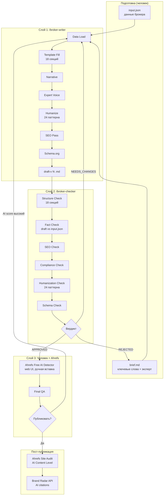

# Интеграция: Writer + Checker + Ahrefs

> Версия: 1.0 | Дата: 2026-04-02
> Статус: SPEC (не реализован)
> Автор: Claude (executor session, task EGOR-BROKER-WRITER-RESEARCH-008)

---

## Общая архитектура

Система состоит из **трёх слоёв**:

```
┌─────────────────────────────────────────────────┐
│  СЛОЙ 1: ГЕНЕРАЦИЯ                              │
│  /broker-writer                                  │
│  Input: input.json + brief.md + template         │
│  Output: draft-v{N}.md                           │
│  Автоматический, запускается человеком            │
└──────────────────────┬──────────────────────────┘
                       │ draft-v{N}.md
                       ▼
┌─────────────────────────────────────────────────┐
│  СЛОЙ 2: АВТОМАТИЧЕСКАЯ ПРОВЕРКА                │
│  /broker-checker                                 │
│  Input: draft + input.json + criteria + template │
│  Output: review-v{N}.md (verdict)                │
│  Автоматический, запускается человеком            │
└──────────────────────┬──────────────────────────┘
                       │ APPROVED / NEEDS_CHANGES / REJECTED
                       ▼
┌─────────────────────────────────────────────────┐
│  СЛОЙ 3: РУЧНАЯ ВЕРИФИКАЦИЯ                     │
│  Человек + Ahrefs (web UI)                       │
│  Input: approved.md                              │
│  Output: ahrefs-checks/{slug}.json               │
│  Ручной, требует человека                        │
└─────────────────────────────────────────────────┘
```

---

## Полный цикл жизни статьи

### Этап 1: Подготовка (человек)

1. Создать `brokers/{slug}/input.json` — структурированные данные брокера
2. Создать `content/{slug}/brief.md` — бриф с ключевыми словами и экспертом
3. Убедиться что template и humanization patterns на месте

### Этап 2: Генерация (автоматический)

```
Человек → /broker-writer {slug}
  ├── Writer читает input.json, brief.md, template, humanization patterns
  ├── Генерирует draft-v1.md (7-этапный процесс)
  ├── Self-check: 18 секций, schema, word count
  ├── Обновляет manifest.json → state: drafted
  └── Git commit: content({slug}): draft v1
```

### Этап 3: Проверка (автоматический)

```
Человек → /broker-checker {slug}
  ├── Checker читает draft-v1.md, input.json, criteria.json, template
  ├── 6 проверок: structure, facts, SEO, compliance, humanization, schema
  ├── Выносит вердикт
  │   ├── APPROVED → копирует draft в approved.md, state: approved
  │   ├── NEEDS_CHANGES → state: revision_requested
  │   └── REJECTED → state: rejected
  ├── Создаёт review-v1.md
  └── Git commit: review({slug}): v1 — {VERDICT}
```

### Этап 3a: Ревизия (если NEEDS_CHANGES)

```
Человек → /broker-writer {slug} --revise
  ├── Writer читает review-v1.md секцию "Required Changes"
  ├── Генерирует draft-v2.md с исправлениями
  ├── Обновляет manifest → state: revised
  └── Git commit: content({slug}): draft v2

Человек → /broker-checker {slug}
  ├── Checker проверяет draft-v2.md
  └── Повторяет до APPROVED или REJECTED
```

### Этап 4: Ahrefs AI Detection (ручной)

```
ТОЛЬКО после APPROVED:
  1. Человек копирует текст approved.md
  2. Вставляет в Ahrefs Free AI Detector (web: ahrefs.com/writing-tools/ai-content-detector)
  3. Записывает результат в quality/ahrefs-checks/{slug}.json
  4. Если AI score >50%:
     ├── Возвращает в writer для дополнительной гуманизации
     └── manifest.state → revision_requested (с пометкой "ahrefs-humanize")
  5. Если AI score ≤50%:
     └── Готов к публикации
```

### Этап 5: Публикация (ручной, вне скоупа)

```
Человек публикует approved.md на сайт
  → manifest.state → published
```

### Этап 6: Пост-публикационный мониторинг (ручной, периодический)

```
Ahrefs Site Explorer → Top Pages → AI Content Level column
Ahrefs Site Audit → Page Explorer → фильтр по AI Content Level
Brand Radar API → GET /v3/brand-radar/ai-responses (если API key есть)
```

---

## Mermaid: полный поток



---

## Ahrefs: что подтверждено и что нет

### Подтверждённые возможности Ahrefs API v3

| Возможность | Endpoint | Автоматизируемо? |
|------------|---------|:----------------:|
| Keyword research | Keywords Explorer API | ✅ (при наличии API key) |
| SERP analysis | SERP Overview API | ✅ |
| Backlink data | Site Explorer API (26 endpoints) | ✅ |
| AI citations monitoring | Brand Radar `GET /v3/brand-radar/ai-responses` | ✅ |
| Site audit data | Site Audit API | ✅ |
| Batch analysis | Batch Analysis API (до 100 targets) | ✅ |

Источник: docs.ahrefs.com/api/reference/

### Подтверждённо ОТСУТСТВУЮЩИЕ возможности

| Возможность | Статус | Источник |
|------------|--------|---------|
| AI content detection API | **НЕТ** — endpoint не существует | docs.ahrefs.com/api, апрель 2026 |
| Bulk pre-publish text check | **НЕТ** — только web tool | Прямая проверка |
| Programmatic AI detection | **НЕТ** — ни API, ни SDK, ни CLI | Прямая проверка |

### Ahrefs web tools (ручные, не автоматизируемые)

| Инструмент | Когда | Ограничения |
|-----------|-------|-------------|
| Free AI Content Detector | Pre-publish | Web-only, несколько сот слов, по одному тексту |
| Page Inspect → AI Detector | Post-publish | Страница должна быть в индексе Ahrefs |
| Top Pages → AI Content Level | Мониторинг | Подписка, после индексации |
| Site Audit → AI Content Level фильтр | Bulk мониторинг | Подписка, после crawl |

### Ahrefs MCP сервер

- **Существует:** api.ahrefs.com/mcp/mcp (hosted, Streamable HTTP)
- **Требует:** Lite план или выше
- **Потребляет:** те же API units, что и прямые API вызовы
- **В нашей сессии:** установлен, но **не авторизован** (OAuth не пройден)
- **Старый GitHub repo** (ahrefs/ahrefs-mcp-server): **архивирован** 24 февраля 2026

---

## Альтернативы Ahrefs для автоматической AI detection

Если нужна **программная** pre-publish проверка (чего Ahrefs не может):

| Сервис | API | Цена | Где использовать |
|--------|:---:|------|-----------------|
| Originality.ai | ✅ | $15-25/мес | Pre-publish gate через API |
| GPTZero | ✅ | $10-30/мес | Pre-publish gate через API |
| Copyleaks | ✅ | Custom | Enterprise |
| Winston AI | ✅ | $12-18/мес | Pre-publish gate |

**Рекомендация:** на старте достаточно ручной Ahrefs проверки. Если масштаб вырастет до 50+ статей/мес → рассмотреть Originality.ai или GPTZero API как автоматический pre-publish gate.

---

## Операционная модель

### Минимальный workflow (1 статья, ручной)

```
Человек вызывает /broker-writer ig
  → ждёт draft
Человек вызывает /broker-checker ig
  → читает review, при NEEDS_CHANGES повторяет
  → при APPROVED: вручную проверяет через Ahrefs web
  → публикует
```

### Масштабированный workflow (batch, в будущем)

```
Для каждого slug в batch:
  /broker-writer {slug}
  /broker-checker {slug}
  → цикл до APPROVED

Batch Ahrefs check (ручной, пост-публикация):
  Site Audit → Page Explorer → AI Content Level

Brand Radar мониторинг (API, автоматический):
  Cron → GET /v3/brand-radar/ai-responses → дашборд
```

---

## Конфигурация (quality/criteria.json)

Checker конфигурируется через `quality/criteria.json`:
- Какие проверки включены
- Severity каждой проверки (P0/P1/P2)
- Пороговые значения (min word count, min FAQ count, etc.)
- AI humanization patterns для поиска

Это позволяет настраивать строгость проверки без изменения кода скилла.

---

## Что оставить на потом

1. **Ahrefs API интеграция для keyword research** — заблокировано на API key / OAuth
2. **Автоматический AI detection через сторонний API** — не нужен на текущем масштабе
3. **n8n автоматизация** — batch-запуск writer+checker через n8n workflows
4. **Публикация** — CMS/сайт не определён, вне скоупа текущей спецификации
5. **Метрики качества** — корреляция AI score с ранжированием, калибровка порогов
